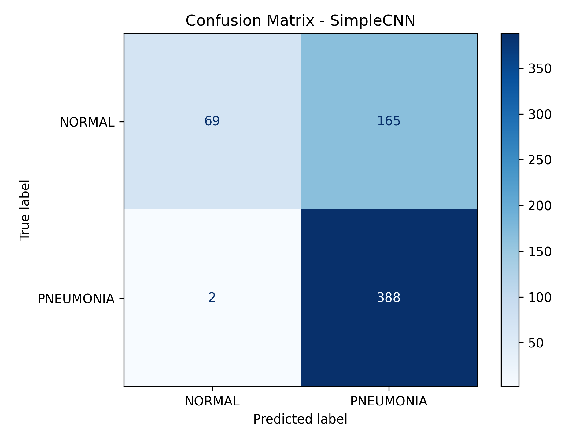
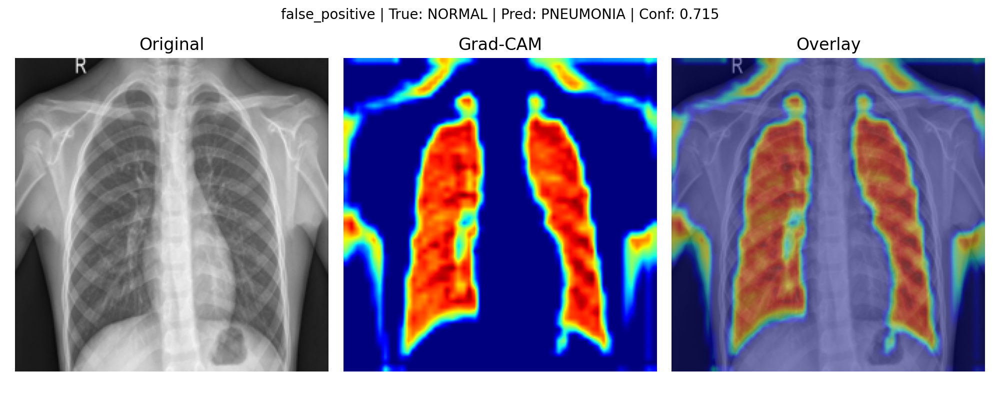
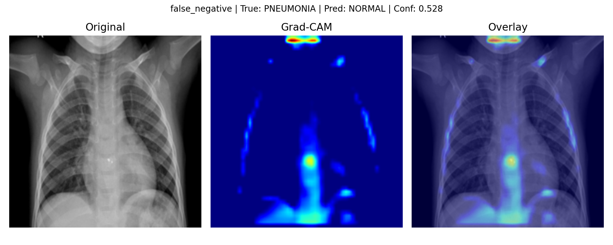
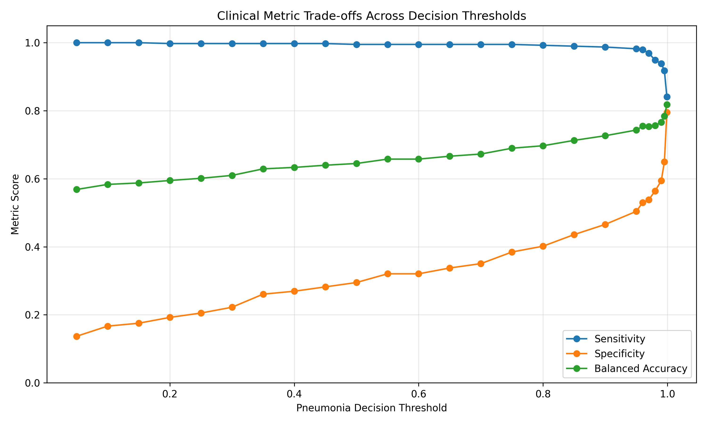
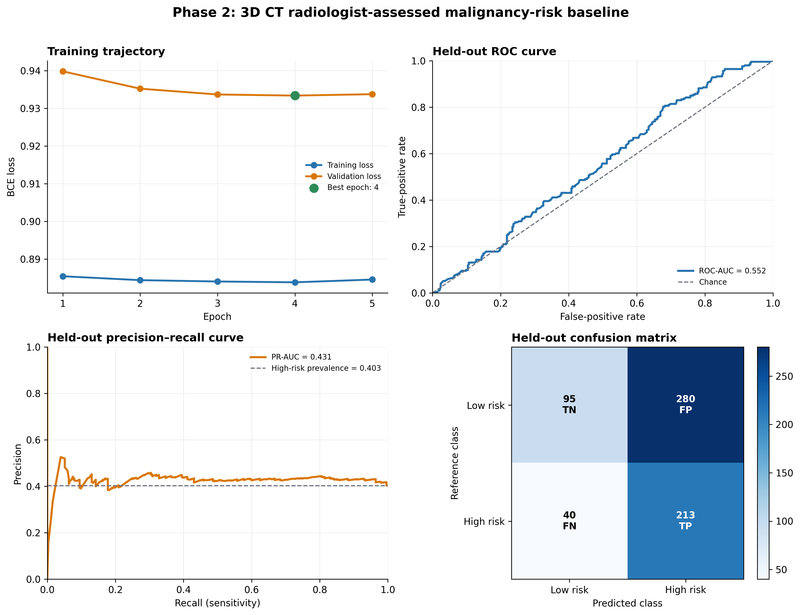
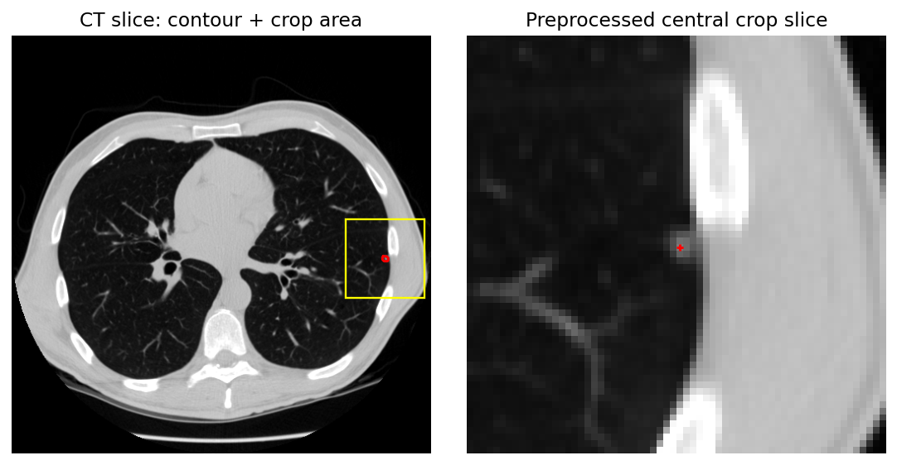

# Oncology Imaging Concept Detection

A reproducible medical-imaging project progressing from controlled 2D
chest-X-ray evaluation to oncology-oriented 3D thoracic CT and pulmonary-nodule
modelling.

The project emphasises reliable medical-image processing, careful experimental design, clinically meaningful evaluation, and transparent interpretation of model behaviour.

## Research Motivation

Medical-imaging models should be evaluated beyond aggregate accuracy. Their
behaviour also depends on sensitivity, specificity, error type, threshold
selection, data leakage, label semantics, and anatomical relevance.

This repository develops those practices in two deliberate stages:

```text
Phase 1: controlled 2D evaluation workflow
    ↓
Phase 2: raw 3D thoracic CT and lesion-level oncology modelling
```

## Project Progression

| Phase | Purpose | Status |
|---|---|---|
| Phase 1 | Establish a clinically informed evaluation workflow | Complete |
| Phase 2 — Model 1 | Build and evaluate a raw-DICOM-to-3D-CNN nodule baseline | Complete |
| Phase 2 — Model 2 | Test joint learning of nodule morphology and malignancy risk | Planned |

## Phase 1 — Controlled Chest-X-Ray Baseline

Phase 1 uses `NORMAL` versus `PNEUMONIA` chest X-rays to establish the
evaluation workflow:

```text
training → standard evaluation → clinical metrics → error analysis
→ Grad-CAM → probability analysis → threshold interpretation
```

The compact CNN was trained for three epochs on 5,216 training images and
evaluated on 624 test images.

| Metric | Default test result |
|---|---:|
| Accuracy | 73.24% |
| Weighted F1 | 68.40% |
| Sensitivity | 99.49% |
| Specificity | 29.49% |
| Balanced accuracy | 64.49% |



The default classifier detected 388 of 390 pneumonia cases but incorrectly
labelled 165 of 234 normal images as pneumonia. This high-sensitivity,
low-specificity behaviour illustrates why accuracy alone is insufficient.

### Representative Grad-CAM errors

<p align="center">
  
  
</p>

These examples help inspect attention to lung anatomy and possible
acquisition-related cues. Grad-CAM is a coarse post-hoc explanation and does
not prove causal reasoning.

### Exploratory threshold analysis



The highest exploratory balanced accuracy was `81.79%` at threshold `0.999`.
Because this threshold was selected **post hoc from test predictions**, it is
not a validated clinical operating point. Phase 2 instead selects its threshold
using validation data only.

## Phase 2 — LIDC-IDRI 3D Pulmonary-Nodule Analysis

Phase 2 operates on raw LIDC-IDRI thoracic CT and predicts
**radiologist-assessed pulmonary-nodule malignancy risk**. These ratings are not
universal pathology-confirmed cancer labels.

### Medical-imaging pipeline

```text
raw DICOM
→ geometric slice ordering
→ Hounsfield-unit conversion
→ radiologist XML annotation parsing
→ exact ROI-to-slice alignment
→ spacing-aware 64 × 64 × 64 nodule crop
→ patient-level split
→ lazy PyTorch dataset
→ compact 3D CNN
→ validation-only checkpoint and threshold selection
→ held-out patient-level evaluation
```

### Dataset and experimental design

The binary modelling dataset contains **742 patients** and **3,918 usable
reader-level radiologist annotations**.

| Split | Patients | Reader-level samples | Low risk | High risk |
|---|---:|---:|---:|---:|
| Train | 519 | 2,754 | 1,754 | 1,000 |
| Validation | 111 | 536 | 294 | 242 |
| Test | 112 | 628 | 375 | 253 |

Target definition:

```text
ratings 1–2 → low radiologist-assessed malignancy risk
rating 3    → excluded as indeterminate
ratings 4–5 → high radiologist-assessed malignancy risk
```

All records from one patient remain in one split, preventing patient-level
cross-split leakage between related annotations.

### Model 1 — Single-Task 3D CNN Baseline

**Status: Complete**

```text
64 × 64 × 64 pulmonary-nodule CT crop
→ compact Simple3DCNN
→ one radiologist-assessed malignancy-risk logit
```

The intentionally compact architecture (69,729 parameters) provides a
controlled reference for Model 2. The checkpoint and classification threshold
were selected on validation data, then frozen for held-out testing.

### Held-out results

| Metric | Model 1 test result |
|---|---:|
| ROC-AUC | **0.552** |
| PR-AUC | **0.431** |
| Sensitivity | **0.842** |
| Specificity | **0.253** |
| F1 | **0.571** |
| Balanced accuracy | **0.548** |



Model 1 achieved high sensitivity but low specificity, with tightly clustered
probabilities and limited discrimination. It is an informative but weak first
3D CT baseline, not evidence of clinical utility.

Detailed metrics and predictions are available in
[`results/phase2/baseline_final/`](results/phase2/baseline_final/).

### Visual validation of lesion localisation



The image shows the CT slice, radiologist contour, physical crop region, and
processed model input. A real-data audit across ten patients confirmed correct
ROI alignment, crop containment, and preprocessing.

### Model 2 — Next Multi-Task Experiment

**Status: Planned — not yet implemented or evaluated**

```text
3D pulmonary-nodule crop
→ shared compact 3D representation
├→ malignancy-risk prediction
├→ spiculation prediction
└→ lobulation prediction
```

Research question:

> Does jointly learning radiologist-assessed pulmonary-nodule morphology
> alongside malignancy risk change the learned representation and improve
> malignancy-risk discrimination compared with the single-task baseline?

Model 2 is a controlled comparison using the same CT pipeline, patient
separation, and a comparable 3D representation—not simply a larger model.

## Repository Structure

```text
oncology-imaging-concept-detection/
├── configs/
│   ├── default.yaml
│   └── phase2_lidc_vertical_slice.yaml
├── docs/
│   ├── error_analysis_notes.md
│   ├── phase2_label_semantics.md
│   └── phase2_lidc_research_plan.md
├── scripts/
│   ├── build_lidc_manifest.py
│   ├── create_lidc_splits.py
│   ├── inspect_lidc_case.py
│   └── visualize_phase2_results.py
├── src/
│   ├── dataset.py, model.py, train.py, evaluate.py   # Phase 1
│   ├── error_analysis.py, gradcam_analysis.py        # Phase 1
│   ├── lidc/                                         # DICOM, XML, crops, dataset
│   ├── models/                                       # Phase 2 3D model
│   ├── training/                                     # Phase 2 training
│   ├── evaluation/                                   # Phase 2 evaluation
│   └── utils/
├── tests/
│   ├── test_hu_conversion.py
│   ├── test_patient_splits.py
│   └── test_phase2_baseline.py
└── results/
    ├── figures/                                      # Phase 1 figures
    ├── metrics/                                      # Phase 1 metrics
    └── phase2/
        ├── one_nodule_crop_validation.png
        └── baseline_final/
            ├── test_metrics.json
            ├── test_predictions.csv
            └── figures/
```

## Reproducibility

Install the declared Python dependencies:

```bash
pip install -r requirements.txt
```

Dataset files are not included in this repository.

### Reproduce Phase 1

```bash
python3 src/download_dataset.py
python3 src/train.py
python3 src/evaluate.py
python3 src/error_analysis.py
python3 src/gradcam_analysis.py
python3 src/threshold_analysis.py
python3 src/visualize_results.py
```

### Reproduce Phase 2

With an existing local LIDC-IDRI DICOM collection configured in
`configs/phase2_lidc_vertical_slice.yaml`:

```bash
python3 scripts/build_lidc_manifest.py
python3 scripts/create_lidc_splits.py
python3 scripts/inspect_lidc_case.py
python3 src/training/train_phase2.py --config configs/phase2_lidc_vertical_slice.yaml
```

Regenerate the Phase 2 result figures without retraining:

```bash
python3 scripts/visualize_phase2_results.py
```

## Limitations

**Phase 1:** The chest-X-ray experiment is a controlled benchmark rather than
an oncology task. Its threshold sweep is post hoc on test predictions, and
Grad-CAM provides only coarse explanations.

**Phase 2:** Malignancy targets are radiologist assessments rather than
universal pathology-confirmed truth. Samples are reader-level annotations, not
consensus physical nodules, so multiple readers may describe the same lesion
within a split. Patient-level separation prevents cross-split leakage but not
within-split reader correlation. Evaluation is limited to LIDC-IDRI, held-out
discrimination is weak, and no external clinical validation has been performed.

## Research Direction

The immediate next experiment is the controlled multi-task Model 2 comparison.
Longer-term interests include concept-level oncology imaging, explainable
clinical AI, cross-site robustness, and—where suitable data support them—
radiomics, radiogenomics, multimodal learning, and privacy-aware healthcare AI.

These directions extend the current work beyond the experiments implemented in this repository