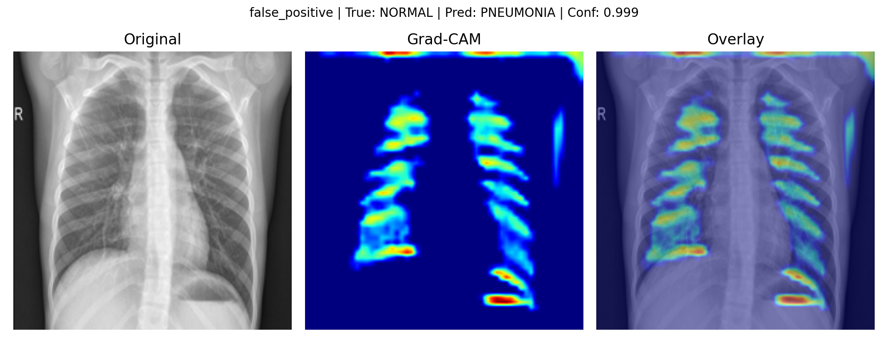
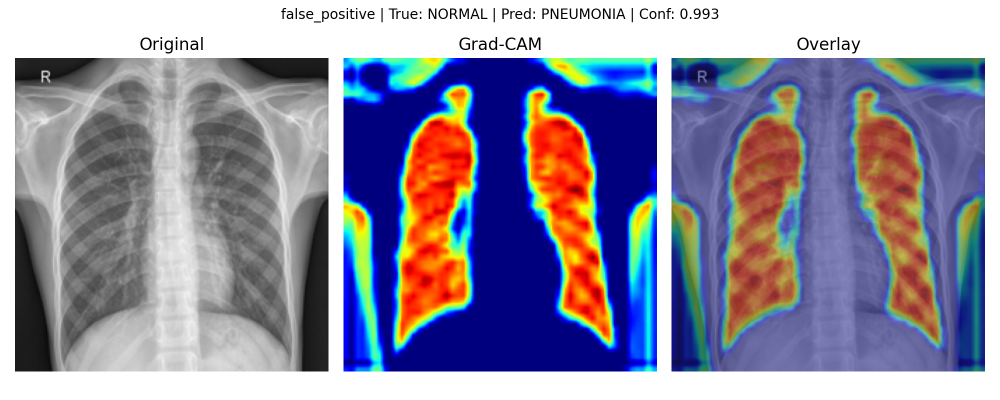
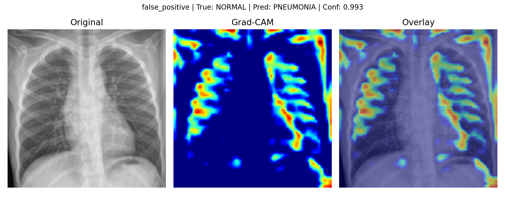
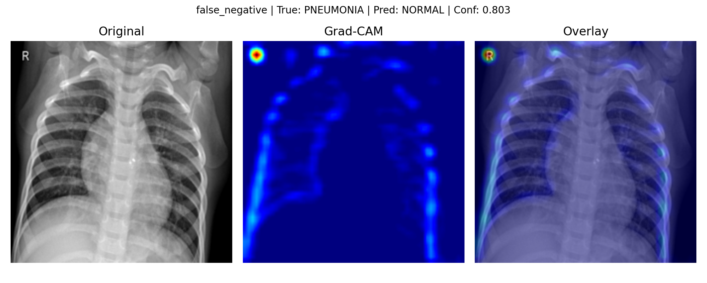
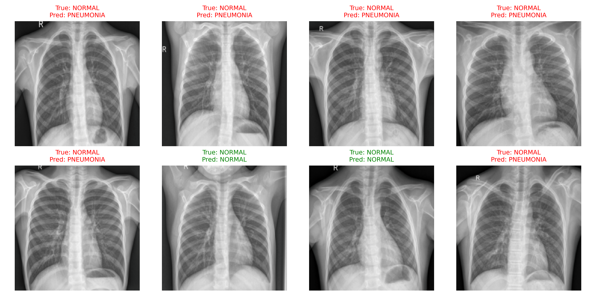

# Oncology Imaging Concept Detection

A PyTorch medical imaging pipeline built toward AI-assisted oncology, starting with a chest X-ray classification baseline and progressing toward clinically meaningful evaluation, explainability, and oncology-relevant imaging workflows.

---

## Overview

Medical imaging pipelines for oncology present unique evaluation challenges: lesion detection, class imbalance, asymmetric misclassification costs, and the need for clinically interpretable model behaviour. This project builds toward that space systematically, beginning with a reproducible chest X-ray baseline before progressing to oncology-specific imaging tasks such as lung nodule analysis, radiomics, and explainable tumour imaging.

The current phase focuses on a controlled medical-imaging classification task to establish the core workflow: dataset loading, model training, clinical metric reporting, error analysis, and Grad-CAM visual explanation.

---

## Phase 1 - Chest X-Ray Baseline

Chest X-ray classification, pneumonia vs normal, serves as a controlled starting point. The dataset is public, well-structured, and widely used for medical imaging experimentation, making it suitable for validating the pipeline before moving into cancer-specific imaging.

### Dataset

[Chest X-Ray Images (Pneumonia)](https://www.kaggle.com/datasets/paultimothymooney/chest-xray-pneumonia) - Kermany et al., *Cell* 2018  
Source dataset: [Mendeley Data](https://data.mendeley.com/datasets/rscbjbr9sj/2)  
License: CC BY 4.0  
5,216 training images - 624 test images - Classes: `NORMAL`, `PNEUMONIA`

### Model

- `SimpleCNN` - 3-layer convolutional backbone
- Input: `[B, 3, 224, 224]`
- Output: binary logits `[B, 2]`
- Loss: Cross-Entropy
- Optimiser: Adam (`lr=1e-3`)

### Training

| Epoch | Train Loss | Train Acc | Val Acc |
|---|---:|---:|---:|
| 1 | 0.1924 | 91.93% | 56.25% |
| 2 | 0.0757 | 97.26% | 68.75% |
| 3 | 0.0564 | 97.89% | 93.75% |

### Test Set Evaluation

| Metric | Score |
|---|---:|
| Accuracy | 73.24% |
| Precision | 80.30% |
| Recall | 73.24% |
| F1-Score | 68.40% |

### Confusion Matrix

| Actual class | Predicted Normal | Predicted Pneumonia |
|---|---:|---:|
| Normal | 69 | 165 |
| Pneumonia | 2 | 388 |

The model misses 2 pneumonia cases out of 390, indicating high sensitivity, but over-flags 165 normal cases as diseased, indicating low specificity. This result demonstrates why accuracy alone is insufficient for medical imaging evaluation.

---

## Clinical Error Analysis and Explainability

To move beyond aggregate accuracy, the baseline was evaluated using clinical error analysis and Grad-CAM visualisation.

| Clinical metric | Score |
|---|---:|
| Sensitivity | 99.49% |
| Specificity | 29.49% |
| False-negative rate | 0.51% |
| False-positive rate | 70.51% |
| Positive predictive value | 70.16% |
| Negative predictive value | 97.18% |
| Balanced accuracy | 64.49% |

The model behaves like a high-sensitivity screening classifier: it identifies nearly all pneumonia cases, but frequently over-predicts pneumonia in normal images. The error analysis produced 165 false positives and 2 false negatives.

Grad-CAM visualisations were generated for selected misclassified examples to inspect whether the model attends to clinically relevant lung regions or non-clinical image artifacts.

### Representative False Positives








### Representative False Negatives




The representative false-positive examples show broad activation across lung fields, rib structures, and some image-boundary regions. This suggests that the model may be responding to general thoracic texture, contrast, rib patterns, or acquisition-related cues rather than a clearly disease-specific abnormality.

The false-negative examples show weaker or less clinically focused activation. One example shows activation near the image marker/top-left region rather than the lung fields, suggesting possible shortcut learning or artifact sensitivity.

A fuller interpretation is available in [`docs/error_analysis_notes.md`](docs/error_analysis_notes.md).

---

## Outputs

### Confusion Matrix


### Prediction Examples



---

## Project Structure

```text
oncology-imaging-concept-detection/
├── docs/
│   ├── notes.md
│   └── error_analysis_notes.md
├── notebooks/
│   └── 01_dataset_exploration.ipynb
├── results/
│   ├── figures/
│   │   ├── confusion_matrix.png
│   │   ├── prediction_examples.png
│   │   └── gradcam/
│   │       ├── false_positive/
│   │       │   ├── 0_NORMAL_pred_PNEUMONIA.png
│   │       │   ├── 1_NORMAL_pred_PNEUMONIA.png
│   │       │   ├── 2_NORMAL_pred_PNEUMONIA.png
│   │       │   └── 3_NORMAL_pred_PNEUMONIA.png
│   │       └── false_negative/
│   │           ├── 390_PNEUMONIA_pred_NORMAL.png
│   │           └── 391_PNEUMONIA_pred_NORMAL.png
│   └── metrics/
│       ├── test_metrics.json
│       ├── clinical_metrics.json
│       └── error_analysis.csv
├── src/
│   ├── dataset.py
│   ├── download_dataset.py
│   ├── model.py
│   ├── train.py
│   ├── evaluate.py
│   ├── error_analysis.py
│   ├── gradcam_analysis.py
│   └── visualize_results.py
├── requirements.txt
└── README.md
```

---

## Direction

The baseline establishes the core workflow for clinically oriented medical imaging AI: reproducible training, evaluation beyond accuracy, error analysis, and visual explainability.

The next stage will move toward oncology-relevant imaging, with emphasis on lung imaging, radiomics features, Grad-CAM/error analysis, and clinically meaningful model validation.

---

## Setup

```bash
git clone https://github.com/Namitha-Narayanan-AI/oncology-imaging-concept-detection
cd oncology-imaging-concept-detection
python -m venv .venv && source .venv/bin/activate
pip install -r requirements.txt
```

```bash
python src/download_dataset.py
python src/train.py
python src/evaluate.py
python src/error_analysis.py
python src/gradcam_analysis.py
python src/visualize_results.py
```

---

## Dataset Attribution

This project uses the public Chest X-Ray Images (Pneumonia) dataset hosted on Kaggle and sourced from the Mendeley dataset released with Kermany et al., *Cell* 2018.

Dataset:

- Kaggle: [Chest X-Ray Images (Pneumonia)](https://www.kaggle.com/datasets/paultimothymooney/chest-xray-pneumonia)
- Source: [Mendeley Data](https://data.mendeley.com/datasets/rscbjbr9sj/2)
- License: CC BY 4.0

This repository includes selected Grad-CAM visualisation outputs derived from the public dataset for educational and research-portfolio purposes.
