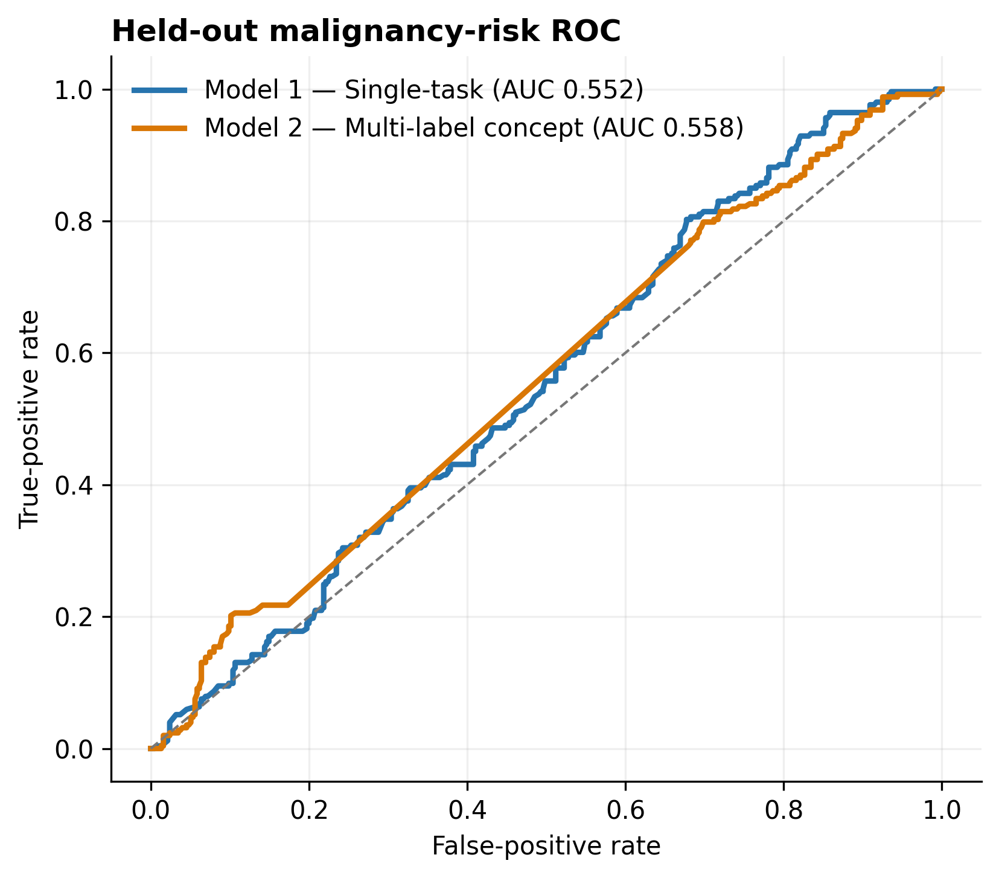
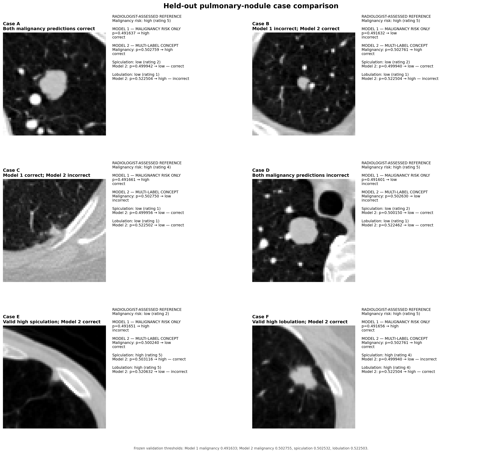

# Oncology Imaging Concept Detection

A reproducible medical-imaging study progressing from controlled 2D
classification to lesion-level 3D thoracic CT and multi-label pulmonary-nodule
concept learning.

The project emphasises clinically meaningful evaluation, patient-separated
experiments, medical-image geometry, radiologist-assessed labels, and honest
interpretation of limited model performance.

## Research Motivation

Medical images rarely represent a single concept. A pulmonary nodule may
simultaneously exhibit characteristics such as spiculation, lobulation, and
perceived malignancy risk. Learning related concepts jointly is one possible
route toward richer and more interpretable imaging representations than a
single binary output.

This study examines that idea using a deliberately compact architecture and a
controlled comparison. Longer term, these questions are relevant to imaging
methods that identify clinically meaningful lesion characteristics reliably
enough to contribute to earlier and more informed cancer assessment. This
repository is not an early cancer-screening system and does not establish
clinical utility.

## Project Progression

```text
Phase 1 — controlled 2D chest-X-ray classification
    ↓
clinical metrics, error analysis, Grad-CAM, threshold interpretation
    ↓
Phase 2 — raw LIDC-IDRI thoracic CT
    ↓
DICOM reconstruction, Hounsfield Units, radiologist annotations,
3D nodule localisation, patient-separated evaluation
    ↓
Model 1 — single-task malignancy-risk baseline
    ↓
Model 2 — multi-label pulmonary-nodule concept model
├── malignancy risk
├── spiculation
└── lobulation
    ↓
Finding — simple morphology supervision did not reliably improve
malignancy-risk discrimination
```

## Phase 1 — Controlled 2D Baseline

Phase 1 established the evaluation workflow using `NORMAL` versus `PNEUMONIA`
chest X-rays. A compact CNN was trained for three epochs on 5,216 training
images and evaluated on 624 test images.

| Metric | Test result |
|---|---:|
| Accuracy | 0.7324 |
| Weighted F1 | 0.6840 |
| Sensitivity | 0.9949 |
| Specificity | 0.2949 |
| Balanced accuracy | 0.6449 |


The large sensitivity–specificity imbalance demonstrates why accuracy alone is
insufficient for healthcare-oriented model evaluation.

### Representative Grad-CAM errors

<p align="center">
  
  
</p>

Grad-CAM provides a coarse post-hoc view of spatial attention; it does not prove
causal model reasoning.

### Threshold interpretation


The Phase 1 threshold sweep was exploratory and performed on test predictions.
Phase 2 therefore uses a stricter procedure: threshold selection on validation
data followed by one evaluation on the held-out test split.

## Phase 2 — 3D Pulmonary-Nodule Analysis

Phase 2 uses raw LIDC-IDRI thoracic CT and reader-level pulmonary-nodule
annotations. The primary target is **radiologist-assessed malignancy risk**,
not pathology-confirmed cancer.

Status: **Phase 2 complete — Model 1 complete; Model 2 complete.**

### Medical-imaging pipeline

```text
raw DICOM series
→ geometric slice ordering
→ Hounsfield-unit conversion
→ LIDC XML annotation parsing
→ exact ROI-to-slice alignment
→ spacing-aware 64 × 64 × 64 nodule crop
→ HU clipping and normalisation
→ lazy PyTorch loading
→ compact 3D CNN
→ validation-only checkpoint and threshold selection
→ held-out patient-level evaluation
```

The pipeline loads required DICOM series and extracts crops in memory. It does
not create a duplicated processed CT dataset or persistent crop cache.

### Dataset and experimental design

The binary malignancy-risk cohort contains 742 patients and 3,918 usable
reader-level annotations.

| Split | Patients | Reader-level samples | Low risk | High risk |
|---|---:|---:|---:|---:|
| Train | 519 | 2,754 | 1,754 | 1,000 |
| Validation | 111 | 536 | 294 | 242 |
| Test | 112 | 628 | 375 | 253 |

Target definition:

```text
ratings 1–2 → low radiologist-assessed malignancy risk
rating 3    → excluded as indeterminate
ratings 4–5 → high radiologist-assessed malignancy risk
```

Every patient belongs to exactly one split. Training-only class weights address
imbalance; validation data select checkpoints and thresholds; test data are
used only after those choices are frozen.

### Visual validation


The figure connects a real CT slice and radiologist contour to the physical crop
region and processed 3D model input. This verification precedes model training
and checks that XML coordinates, DICOM geometry, and NumPy indexing agree.

### Model 1 — Single-Task Baseline

Model 1 is a 69,729-parameter 3D CNN with three convolutional blocks and one
binary malignancy-risk head. It provides the controlled baseline for evaluating
concept-level supervision.


### Model 2 — Multi-Label Pulmonary-Nodule Concept Model

Model 2 is scientifically framed as multi-label concept learning and
implemented as a shared multi-task 3D CNN:

```text
64³ pulmonary-nodule crop
→ the same compact 3D encoder used by Model 1
→ shared 64-dimensional lesion representation
├── malignancy-risk head
├── spiculation head
└── lobulation head
```

Spiculation and lobulation ratings use the same low/high conversion as the
primary task. Rating 3 and unavailable auxiliary labels are masked, so a valid
malignancy sample is not discarded when an auxiliary target is indeterminate.
Model 2 contains 69,859 parameters—only the two additional linear heads differ
from Model 1.

### Final comparison

| Metric | Model 1 — Single-task | Model 2 — Multi-label concept |
|---|---:|---:|
| ROC-AUC | 0.5524 | 0.5578 |
| PR-AUC | 0.4309 | 0.4425 |
| Sensitivity | 0.8419 | 0.8221 |
| Specificity | 0.2533 | 0.2560 |
| F1 | 0.5710 | 0.5622 |
| Balanced accuracy | 0.5476 | 0.5391 |



Model 2 produced small numerical increases in ROC-AUC and PR-AUC but lower F1
and balanced accuracy. Patient-level bootstrap intervals for the differences in
ROC-AUC, PR-AUC, and balanced accuracy all included zero. Joint morphology
supervision therefore provided **no clear evidence of improved malignancy-risk
discrimination** under this compact formulation.



Representative held-out cases illustrate the difference between the two
formulations: Model 1 predicts malignancy risk only, whereas Model 2 additionally
predicts radiologist-assessed spiculation and lobulation. The examples include
agreements and failures from both models; they are qualitative and do not imply
clinical utility or explain model reasoning.

Auxiliary spiculation and lobulation discrimination also remained limited.
Strong class imbalance, reader variability, and conversion of ordinal ratings
to binary concepts may restrict the usefulness of naive auxiliary supervision.

An exploratory analysis stratified held-out performance by CT slice thickness
(`≤2 mm` versus `>2 mm`) using globally frozen thresholds. The results were
mixed and are treated only as exploratory analysis of acquisition
heterogeneity—not robustness validation.

Additional held-out PR, probability, confusion-matrix, training, concept, and
heterogeneity outputs are available under
[`results/phase2/multitask_final/`](results/phase2/multitask_final/).

## What the Study Shows

- Raw thoracic CT can be connected reproducibly to reader annotations and
  lesion-centred 3D inputs without duplicating the source dataset.
- Patient-level separation and validation-only decision selection prevent two
  common sources of optimistic medical-imaging evaluation.
- A shared multi-label representation does not automatically improve the
  primary task; auxiliary label quality, balance, and formulation matter.
- Negative comparative findings remain informative when the experimental
  design and limitations are transparent.
- Moving beyond a single binary prediction toward clinically interpretable
  imaging concepts may provide a richer representation of lesion
  characteristics for future clinical-AI research, but this experiment does
  not establish such a benefit.

## Limitations

- LIDC malignancy and morphology ratings are radiologist assessments rather
  than universal pathology-confirmed truth.
- Samples are reader-level annotations, not consensus physical nodules;
  multiple annotations may describe the same lesion within a split.
- Spiculation and lobulation have severe positive-class imbalance.
- Binary conversion discards the ordinal structure of the original ratings.
- Both models are deliberately compact and show weak held-out discrimination.
- Evaluation uses one dataset and includes no external clinical validation.
- The slice-thickness analysis is descriptive and does not demonstrate
  robustness across scanners, protocols, institutions, or populations.

## Reproducibility

Install the declared dependencies:

```bash
pip install -r requirements.txt
```

LIDC-IDRI must be obtained separately and configured locally. Raw DICOM and XML
data are not included in this repository.

### Phase 1

```bash
python3 src/download_dataset.py
python3 src/train.py
python3 src/evaluate.py
python3 src/error_analysis.py
python3 src/gradcam_analysis.py
python3 src/threshold_analysis.py
python3 src/visualize_results.py
```

### Phase 2

```bash
python3 scripts/build_lidc_manifest.py
python3 scripts/create_lidc_splits.py
python3 scripts/inspect_lidc_case.py

python3 src/training/train_phase2.py \
  --config configs/phase2_lidc_vertical_slice.yaml

python3 src/training/train_phase2_multitask.py \
  --config configs/phase2_multitask_final.yaml

python3 scripts/analyze_phase2_final.py
MPLBACKEND=Agg python3 scripts/visualize_phase2_model_comparison.py
```

The final experiment uses seed 42, `64³` crops, batch size 2, Adam with learning
rate `0.001`, five CPU epochs, and validation malignancy loss for checkpoint
selection.

## Repository Structure

```text
oncology-imaging-concept-detection/
├── configs/
│   ├── default.yaml
│   ├── phase2_lidc_vertical_slice.yaml
│   └── phase2_multitask_final.yaml
├── docs/                                  # Research plan and label semantics
├── scripts/
│   ├── build_lidc_manifest.py
│   ├── create_lidc_splits.py
│   ├── inspect_lidc_case.py
│   ├── analyze_phase2_final.py
│   ├── visualize_phase2_results.py
│   ├── visualize_phase2_model_comparison.py
│   └── visualize_phase2_qualitative_cases.py
├── src/
│   ├── dataset.py, model.py, train.py      # Phase 1
│   ├── evaluate.py, error_analysis.py      # Phase 1
│   ├── gradcam_analysis.py                 # Phase 1
│   ├── lidc/                               # DICOM, XML, crops, lazy dataset
│   ├── models/
│   │   ├── simple_3d_cnn.py
│   │   └── multitask_3d_cnn.py
│   ├── training/
│   │   ├── train_phase2.py
│   │   └── train_phase2_multitask.py
│   └── evaluation/                         # Metrics and threshold selection
├── tests/                                  # DICOM, split, crop and model tests
└── results/
    └── phase2/
        ├── one_nodule_crop_validation.png
        ├── baseline_final/
        └── multitask_final/
```

## Future Directions

Several extensions could strengthen the current concept-learning framework. Preserving the ordinal structure of radiologist ratings, explicitly modelling inter-reader disagreement, and evaluating additional clinically meaningful lesion concepts may provide richer supervision than the binary formulation used here.

Robustness also remains an important direction. Evaluation across scanners, acquisition protocols, institutions, and patient populations would help determine whether learned concept representations remain stable under clinical domain shift. In settings where imaging data cannot be centrally pooled, federated learning offers a relevant framework for studying multi-institutional learning while preserving local data governance.

With appropriately linked datasets, the same framework could also be extended beyond imaging-only concepts through clinical text, longitudinal imaging, radiomics, or molecular information. Such extensions would allow future studies to investigate whether richer, interpretable representations can support more reliable lesion characterisation and, ultimately, earlier and more informed cancer assessment.
